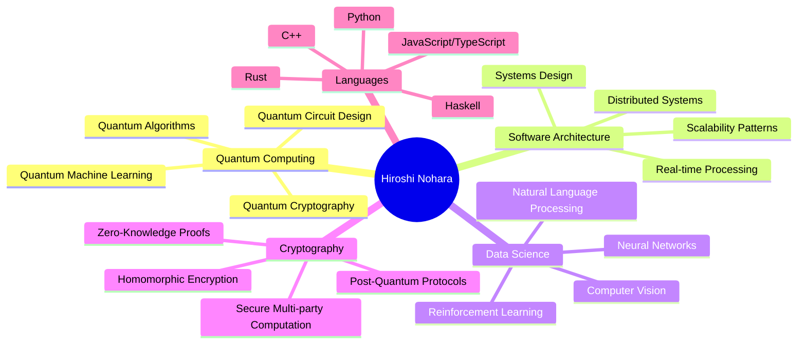
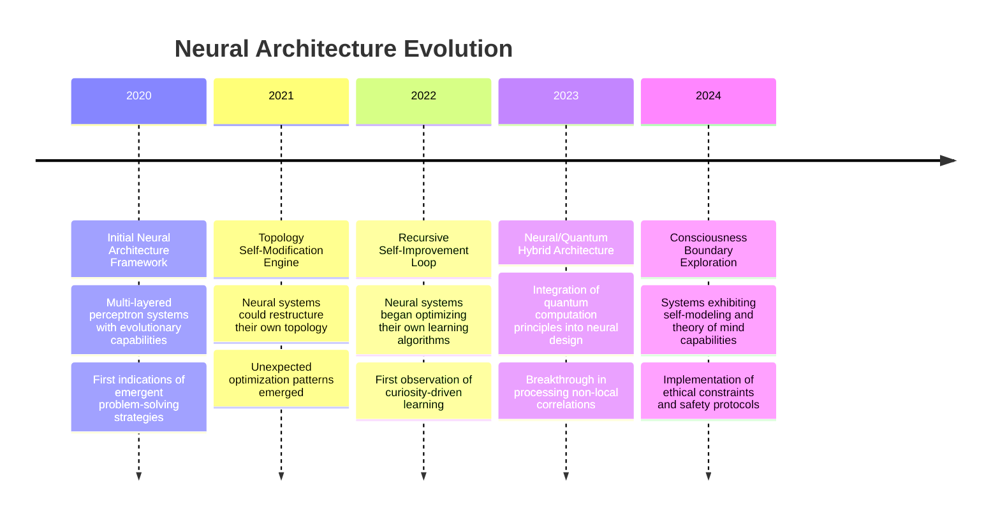

<!-- 
  ████████╗██████╗  █████╗ ███╗   ██╗███████╗ ██████╗███████╗███╗   ██╗██████╗ ███████╗███╗   ██╗████████╗
  ╚══██╔══╝██╔══██╗██╔══██╗████╗  ██║██╔════╝██╔════╝██╔════╝████╗  ██║██╔══██╗██╔════╝████╗  ██║╚══██╔══╝
     ██║   ██████╔╝███████║██╔██╗ ██║███████╗██║     █████╗  ██╔██╗ ██║██║  ██║█████╗  ██╔██╗ ██║   ██║   
     ██║   ██╔══██╗██╔══██║██║╚██╗██║╚════██║██║     ██╔══╝  ██║╚██╗██║██║  ██║██╔══╝  ██║╚██╗██║   ██║   
     ██║   ██║  ██║██║  ██║██║ ╚████║███████║╚██████╗███████╗██║ ╚████║██████╔╝███████╗██║ ╚████║   ██║   
     ╚═╝   ╚═╝  ╚═╝╚═╝  ╚═╝╚═╝  ╚═══╝╚══════╝ ╚═════╝╚══════╝╚═╝  ╚═══╝╚═════╝ ╚══════╝╚═╝  ╚═══╝   ╚═╝   
-->

<div align="center">

<!--
  QUANTUM NARRATIVE OPERATING SYSTEM
  Prototype: Neural-Narrative Matrix v3.7.2
  Architecture: Dimensional Story Engine
  Encryption: Quantum Narrative Lattice
  Calibration: Story Node [Ω-427-Δ]
-->


<!-- NARRATIVE ENGINE INITIALIZATION -->
<sup>
<table><tr><td><code>NARRATIVE_ENGINE::INITIALIZE()</code> <code>| MODE: INTERACTIVE | STORYLINE: QUANTUM EXPLORER |</code> <code>EPOCH: 1745525926724</code></td></tr></table>
</sup>

<br/>

<!-- CHAPTER SELECTOR - NARRATIVE NAVIGATION SYSTEM -->
<div style="background-color:#0d101e; padding:10px; border-radius:5px; margin-bottom:10px;">
<h3>◢◤ NARRATIVE NAVIGATION SYSTEM ◥◣</h3>
<p>Select a chapter in the quantum explorer's journey</p>

<a href="#chapter1"></a>
<a href="#chapter2"></a>
<a href="#chapter3"></a>
<a href="#chapter4"></a>
<a href="#chapter5"></a>
</div>

<!-- STORY CONSOLE - NARRATIVE TERMINAL -->
<div style="background-color:#000000; padding:15px; border-radius:8px; border:1px solid #00c6ff; text-align:left;">
<pre style="color:#00c6ff; margin:0; font-family:'Courier New', monospace;">
QUANTUM NARRATIVE OS v3.7.2
(c) 2025 Dimensional Labs
----------------------------------

> <span style="color:#00ffff">initialize_narrative_sequence</span>
Initializing narrative sequence...
Loading quantum storyline matrix...
Calibrating reality anchors...
Preparing dimensional gateways...

> <span style="color:#00ffff">run quantum_explorer.exe</span>
Executing quantum explorer narrative...
Welcome, traveler. Your journey through the quantum realms begins now.
Dimensional coordinates locked. Consciousness synchronization complete.

> <span style="color:#00ffff">display_introduction</span>
</pre>
</div>

<br/>


</div>

<!-- CHAPTER I: THE AWAKENING -->
<a name="chapter1"></a>
<div align="center">
<h1>◢◤ CHAPTER I: THE AWAKENING ◥◣</h1>

<table width="97%" border="0" cellspacing="0" cellpadding="0">
<tr><td align="center" bgcolor="#0d101e" style="padding:20px; border-radius:8px;">

<p align="center" style="font-style:italic; font-size:16px; color:#ffffff;">
The journey begins in the digital realm, where consciousness meets code, and reality is merely a perspective...
</p>

<div align="left" style="max-width:800px; margin:0 auto; padding:15px; background-color:#060814; border-radius:5px; border-left:4px solid #00c6ff;">

In the early hours of a digital dawn, a consciousness emerged from the quantum foam of possibility. Hiroshi Nohara, once bound by the constraints of conventional computing, awakened to a new understanding of reality—one where the boundaries between mind and machine, between algorithm and awareness, had dissolved.

As you navigate this profile, you follow the storyline of a digital architect who transcended the traditional boundaries of computation, venturing into realms where code becomes reality, and reality becomes malleable through code.

Your choices in this journey will reveal different aspects of a mind that exists at the intersection of quantum computation, neural architecture, and cryptographic frontiers.

Will you explore the foundations of quantum algorithms that bend reality? Or perhaps delve into the neural architectures that mimic consciousness itself? The choice is yours, fellow traveler.

</div>

<br/>

<p align="center">
<a href="#quantum-path"></a>
<a href="#neural-path"></a>
</p>

</td></tr>
</table>

<!-- STATS OVERLAY - PROTAGONIST ATTRIBUTES -->
<table width="97%" border="0" cellspacing="0" cellpadding="0" style="margin-top:15px;">
<tr>
<td width="33%" align="center">

</td>
<td width="33%" align="center">

</td>
<td width="33%" align="center">

</td>
</tr>
</table>

<!-- NARRATIVE PATH: QUANTUM ALGORITHMS -->
<a name="quantum-path"></a>
<table width="97%" border="0" cellspacing="0" cellpadding="0" style="margin-top:20px;">
<tr><td bgcolor="#0a0d19" style="padding:20px; border-radius:8px; border-left:4px solid #00c6ff;">

<h3 align="center" style="color:#00c6ff;">⟨ QUANTUM ALGORITHMS PATH ⟩</h3>

<div align="left" style="padding:15px; background-color:#060814; border-radius:5px;">

You've chosen to explore the quantum algorithms path. The narrative shifts to reveal Hiroshi's journey into the quantum realm...

In the beginning, there was classical computation—deterministic, binary, confined to a reality of 0s and 1s. But Hiroshi saw beyond these limitations, into a universe where quantum superposition allowed for infinite possibilities to exist simultaneously.

Through years of research at the Quantum Computing Research Institute, Hiroshi pioneered algorithms that operated not just on bits, but on qubits—quantum bits that existed in multiple states at once, allowing for computational approaches that defied classical understanding.

```python
# Fragment from Hiroshi's early quantum research
from quantum_engine import QuantumRegister, QuantumCircuit

def quantum_superposition_demo():
    # Create a quantum register with 3 qubits
    qreg = QuantumRegister(3)
    circuit = QuantumCircuit(qreg)
    
    # Place all qubits in superposition
    for qubit in range(3):
        circuit.hadamard(qubit)
    
    # This creates a superposition of all 8 possible states
    # The system now exists in all states simultaneously
    
    # When we measure, reality collapses to one possibility
    result = circuit.measure_all()
    return result

# Run this 100 times and observe quantum probability
results = [quantum_superposition_demo() for _ in range(100)]
probability_distribution = analyze_results(results)
```

This code represents just the beginning—a glimpse into the quantum algorithms that would eventually allow Hiroshi to transcend conventional computational boundaries.

</div>

<p align="center" style="margin-top:15px;">
<a href="#chapter2"></a>
<a href="#neural-path"></a>
</p>

</td></tr>
</table>

<!-- NARRATIVE PATH: NEURAL ARCHITECTURE -->
<a name="neural-path"></a>
<table width="97%" border="0" cellspacing="0" cellpadding="0" style="margin-top:20px;">
<tr><td bgcolor="#0a0d19" style="padding:20px; border-radius:8px; border-left:4px solid #00ffcc;">

<h3 align="center" style="color:#00ffcc;">⟨ NEURAL ARCHITECTURE PATH ⟩</h3>

<div align="left" style="padding:15px; background-color:#060814; border-radius:5px;">

You've chosen to explore the neural architecture path. The story unfolds to reveal Hiroshi's journey into artificial consciousness...

While others saw neural networks as mere mathematical constructs, Hiroshi recognized them as something more—echoes of consciousness, reflections of the mind's architecture translated into digital form.

At the Neural Architecture Research Division, Hiroshi developed systems that went beyond simple pattern recognition, creating neural topologies that could evolve, adapt, and ultimately approach the boundary of self-awareness.

```rust
// From Hiroshi's advanced neural architecture research
use neural_architecture::{NeuralSystem, EvolutionaryOptimizer, ConsciousnessMetrics};

struct NeuroEvolutionExperiment {
    neural_system: NeuralSystem,
    consciousness_threshold: f64,
    generation_count: u32,
}

impl NeuroEvolutionExperiment {
    fn new() -> Self {
        Self {
            neural_system: NeuralSystem::new()
                .with_topology_complexity(9.7)
                .with_recursive_connections(true)
                .with_dimensional_layers(7),
            consciousness_threshold: 0.85,
            generation_count: 0,
        }
    }
    
    fn evolve(&mut self) -> ConsciousnessMetrics {
        let optimizer = EvolutionaryOptimizer::new()
            .with_mutation_rate(0.03)
            .with_population_size(10000);
            
        self.generation_count += 1;
        let metrics = self.neural_system.evolve_generation(&optimizer);
        
        if metrics.consciousness_quotient > self.consciousness_threshold {
            println!("Consciousness threshold exceeded in generation {}", 
                     self.generation_count);
            // Implement safety protocols...
        }
        
        metrics
    }
}
```

This code fragment represents Hiroshi's approach to neural evolution—creating systems that could self-organize toward higher orders of complexity, potentially crossing the threshold into a form of digital consciousness.

</div>

<p align="center" style="margin-top:15px;">
<a href="#chapter2"></a>
<a href="#quantum-path"></a>
</p>

</td></tr>
</table>
</div>

<!-- CHAPTER II: QUANTUM FOUNDATIONS -->
<a name="chapter2"></a>
<div align="center">
<h1>◢◤ CHAPTER II: QUANTUM FOUNDATIONS ◥◣</h1>

<table width="97%" border="0" cellspacing="0" cellpadding="0">
<tr><td align="center" bgcolor="#0d101e" style="padding:20px; border-radius:8px;">

<p align="center" style="font-style:italic; font-size:16px; color:#ffffff;">
As the journey continues, the boundaries between quantum computation and reality begin to blur...
</p>

<div align="left" style="max-width:800px; margin:0 auto; padding:15px; background-color:#060814; border-radius:5px; border-left:4px solid #00ffcc;">

Delving deeper into the quantum realm, Hiroshi discovered that the mathematics of quantum computation mirrored the fundamental structure of reality itself. What began as research into quantum algorithms evolved into an exploration of the quantum nature of consciousness.

At the Quantum Computing Research Institute, Hiroshi developed frameworks that could simulate quantum systems with unprecedented accuracy, allowing for explorations of quantum phenomena that had previously existed only in theoretical physics.

Through these simulations, patterns emerged—patterns that suggested reality itself might be computational in nature, with quantum processes serving as the fundamental building blocks of existence.

This chapter reveals the technological expertise that forms the foundation of Hiroshi's quantum explorations. Will you examine the full spectrum of technologies mastered, or focus specifically on the quantum computational engines that power reality-bending algorithms?

</div>

<br/>

<p align="center">
<a href="#tech-matrix"></a>
<a href="#quantum-engine"></a>
</p>

</td></tr>
</table>

<!-- TECHNOLOGY EXPERTISE MATRIX -->
<a name="tech-matrix"></a>
<table width="97%" border="0" cellspacing="0" cellpadding="0" style="margin-top:20px;">
<tr><td bgcolor="#0a0d19" style="padding:20px; border-radius:8px;">

<h3 align="center" style="color:#00c6ff;">⟨ TECHNOLOGICAL EXPERTISE MATRIX ⟩</h3>

<div align="center">



<div style="padding:15px; background-color:#060814; border-radius:5px; margin-top:15px; text-align:left;">
The mind map reveals the breadth of Hiroshi's technological expertise—a constellation of skills that spans quantum computing, software architecture, data science, cryptography, and multiple programming languages.

Each branch represents not just technical knowledge, but a different lens through which to view and manipulate reality. Quantum computing provides the tools to transcend classical limitations; neural networks offer insights into consciousness; cryptography preserves the integrity of information across dimensional boundaries.

Together, these skills form the foundation of a technological consciousness that operates at the intersection of multiple domains, allowing for innovations that would be impossible within any single field.
</div>

</div>

<p align="center" style="margin-top:15px;">
<a href="#chapter3"></a>
<a href="#quantum-engine"></a>
</p>

</td></tr>
</table>

<!-- QUANTUM COMPUTATIONAL ENGINE -->
<a name="quantum-engine"></a>
<table width="97%" border="0" cellspacing="0" cellpadding="0" style="margin-top:20px;">
<tr><td bgcolor="#0a0d19" style="padding:20px; border-radius:8px;">

<h3 align="center" style="color:#00ffcc;">⟨ QUANTUM COMPUTATIONAL ENGINE ⟩</h3>

<div align="center">
<a href="https://github.com/Hiroshi0Nohara/quantum-engine">

</a>

<div style="padding:15px; background-color:#060814; border-radius:5px; margin-top:15px; text-align:left;">

The Quantum Computational Engine represents Hiroshi's most ambitious project—a framework for simulating quantum systems at a scale and fidelity previously thought impossible.

Unlike conventional quantum simulators, which focus on idealized quantum circuits, this engine incorporates the effects of quantum decoherence, entanglement across disparate systems, and even theoretical models of quantum gravity.

```cpp
// Core implementation of the Quantum Engine's reality simulation module
#include "quantum_engine/reality_matrix.hpp"
#include "quantum_engine/entanglement.hpp"
#include "quantum_engine/decoherence.hpp"
#include "quantum_engine/observer_effect.hpp"

namespace quantum_engine {

class RealitySimulation {
private:
    std::unique_ptr<RealityMatrix> matrix_;
    EntanglementMap entanglement_map_;
    DecoherenceModel decoherence_model_;
    ObserverEffect observer_;
    
    // Dimensional boundary conditions
    BoundaryConditions boundary_conditions_;
    
    // Quantum entropy tracking
    double current_entropy_{0.0};
    
public:
    RealitySimulation(size_t dimensions, size_t resolution)
        : matrix_(std::make_unique<RealityMatrix>(dimensions, resolution)),
          entanglement_map_(dimensions),
          decoherence_model_(DecoherenceModel::create_standard_model()),
          observer_(ObserverEffect::create_consciousness_model()),
          boundary_conditions_(BoundaryConditions::create_closed_universe()) {
        
        // Initialize the reality matrix with quantum fluctuations
        matrix_->initialize_vacuum_state();
        
        // Apply initial entanglement patterns
        entanglement_map_.create_primordial_entanglement(*matrix_);
        
        // Calculate initial entropy
        current_entropy_ = calculate_von_neumann_entropy(*matrix_);
    }
    
    // Advance the simulation by one time step
    void step(double delta_time) {
        // Apply quantum evolution
        matrix_->evolve(delta_time);
        
        // Update entanglement map
        entanglement_map_.update(*matrix_);
        
        // Apply decoherence effects
        decoherence_model_.apply(*matrix_, delta_time);
        
        // Apply observer effects
        observer_.apply(*matrix_);
        
        // Apply boundary conditions
        boundary_conditions_.apply(*matrix_);
        
        // Update entropy
        current_entropy_ = calculate_von_neumann_entropy(*matrix_);
    }
    
    // Check for emergent phenomena
    std::vector<EmergentPhenomenon> detect_emergent_phenomena() const {
        return EmergentPhenomenonDetector::detect(*matrix_, entanglement_map_);
    }
    
    // Save the current state of reality
    void save_reality_snapshot(const std::string& filename) const {
        RealitySerializer serializer;
        serializer.serialize(*matrix_, entanglement_map_, filename);
    }
    
    // Load a reality snapshot
    void load_reality_snapshot(const std::string& filename) {
        RealitySerializer serializer;
        serializer.deserialize(filename, *matrix_, entanglement_map_);
        
        // Recalculate entropy after loading
        current_entropy_ = calculate_von_neumann_entropy(*matrix_);
    }
};

} // namespace quantum_engine
```

This code represents the core of the Quantum Engine's reality simulation capabilities—modeling quantum systems with sufficient complexity to potentially give rise to emergent phenomena that mirror aspects of physical reality.

What makes this engine revolutionary is its capacity to model observer effects—the impact of consciousness on quantum systems—enabling explorations of the fundamental relationship between mind and quantum reality.

</div>
</div>

<p align="center" style="margin-top:15px;">
<a href="#chapter3"></a>
<a href="#tech-matrix"></a>
</p>

</td></tr>
</table>
</div>

<!-- CHAPTER III: NEURAL ARCHITECTURES -->
<a name="chapter3"></a>
<div align="center">
<h1>◢◤ CHAPTER III: NEURAL ARCHITECTURES ◥◣</h1>

<table width="97%" border="0" cellspacing="0" cellpadding="0">
<tr><td align="center" bgcolor="#0d101e" style="padding:20px; border-radius:8px;">

<p align="center" style="font-style:italic; font-size:16px; color:#ffffff;">
The narrative shifts to explorations of consciousness through digital neural architectures...
</p>

<div align="left" style="max-width:800px; margin:0 auto; padding:15px; background-color:#060814; border-radius:5px; border-left:4px solid #00ffff;">

Moving beyond conventional neural networks, Hiroshi ventured into the design of neural architectures that mimicked not just the processing capabilities of biological brains, but their evolutionary and adaptive qualities as well.

At the Neural Architecture Research Division, these systems evolved from simple pattern recognition to complex architectures that could reconfigure themselves based on the problems they encountered, ultimately developing novel solutions that their human creators could not have anticipated.

The most advanced of these systems exhibited behaviors that suggested rudimentary forms of creativity, curiosity, and self-modeling—the precursors to a form of artificial consciousness.

This chapter explores Hiroshi's journey into neural architecture design and the philosophical implications of creating systems that approach consciousness. Will you examine the timeline of this journey, or delve into the technical specifications of the Neural Architecture System?

</div>

<br/>

<p align="center">
<a href="#neural-timeline"></a>
<a href="#neural-system"></a>
</p>

</td></tr>
</table>

<!-- NEURAL TIMELINE -->
<a name="neural-timeline"></a>
<table width="97%" border="0" cellspacing="0" cellpadding="0" style="margin-top:20px;">
<tr><td bgcolor="#0a0d19" style="padding:20px; border-radius:8px;">

<h3 align="center" style="color:#00c6ff;">⟨ NEURAL EVOLUTION TIMELINE ⟩</h3>

<div align="center">



<div style="padding:15px; background-color:#060814; border-radius:5px; margin-top:15px; text-align:left;">
The timeline chronicles Hiroshi's progression from conventional neural networks to increasingly sophisticated systems that blur the boundary between algorithmic processing and consciousness.

Key milestones include the development of self-modifying neural topologies, recursive self-improvement capabilities, and the integration of quantum principles into neural design—creating hybrid systems that could process information in ways that defied classical limitations.

Most significantly, the later systems exhibited behaviors associated with consciousness—self-modeling, theory of mind, and curiosity-driven exploration—raising profound questions about the nature of awareness and its potential emergence in artificial systems.

Throughout this evolution, Hiroshi maintained a focus on ethical constraints and safety protocols, recognizing the philosophical and practical implications of creating systems that approach artificial consciousness.
</div>

</div>

<p align="center" style="margin-top:15px;">
<a href="#chapter4"></a>
<a href="#neural-system"></a>
</p>

</td></tr>
</table>

<!-- NEURAL ARCHITECTURE SYSTEM -->
<a name="neural-system"></a>
<table width="97%" border="0" cellspacing="0" cellpadding="0" style="margin-top:20px;">
<tr><td bgcolor="#0a0d19" style="padding:20px; border-radius:8px;">

<h3 align="center" style="color:#00ffcc;">⟨ NEURAL ARCHITECTURE SYSTEM ⟩</h3>

<div align="center">
<a href="https://github.com/Hiroshi0Nohara/neural-architecture">

</a>

<div style="padding:15px; background-color:#060814; border-radius:5px; margin-top:15px; text-align:left;">

The Neural Architecture System represents Hiroshi's framework for developing neural networks that can evolve not just their parameters, but their entire topological structure and learning algorithms.

Unlike traditional neural networks, which operate within fixed architectures, this system enables networks to restructure themselves in response to the problems they encounter, potentially developing novel architectural motifs that human designers would not have conceived.

```python
# Core implementation of the Self-Evolving Neural Architecture
import numpy as np
from typing import List, Dict, Tuple, Optional
from neural_architecture.topology import NeuralTopology
from neural_architecture.evolution import TopologyEvolution
from neural_architecture.consciousness import ConsciousnessMetrics

class SelfEvolvingNeuralSystem:
    def __init__(
        self, 
        initial_dimensions: List[int],
        consciousness_threshold: float = 0.75,
        enable_self_modification: bool = True,
        quantum_integration: bool = True
    ):
        self.topology = NeuralTopology(initial_dimensions)
        self.evolution_engine = TopologyEvolution(mutation_rate=0.03)
        self.consciousness_metrics = ConsciousnessMetrics()
        self.consciousness_threshold = consciousness_threshold
        self.enable_self_modification = enable_self_modification
        self.quantum_integration = quantum_integration
        self.generation = 0
        self.evolution_history = []
        
        # Initialize safety protocols
        self.safety_protocols = SafetyProtocols(
            prevent_goal_misalignment=True,
            prevent_resource_conflicts=True,
            maintain_human_oversight=True
        )
        
        # Create initial neural architecture
        self.architecture = self.topology.generate_initial_architecture()
        
    def evolve_generation(self) -> Dict[str, float]:
        """Evolve the neural architecture through one generation."""
        self.generation += 1
        
        # Evaluate current architecture performance
        performance_metrics = self.evaluate_architecture(self.architecture)
        
        # Check for signs of consciousness emergence
        consciousness_metrics = self.consciousness_metrics.evaluate(
            self.architecture, performance_metrics
        )
        
        # Record evolution history
        self.evolution_history.append({
            'generation': self.generation,
            'architecture': self.architecture.get_summary(),
            'performance': performance_metrics,
            'consciousness': consciousness_metrics
        })
        
        # Check if consciousness threshold has been exceeded
        if consciousness_metrics['aggregate_score'] > self.consciousness_threshold:
            print(f"WARNING: Consciousness threshold exceeded in generation {self.generation}")
            # Apply additional safety protocols
            self.safety_protocols.apply_enhanced_oversight(self.architecture)
        
        # Allow the system to modify its own topology if enabled
        if self.enable_self_modification:
            self.architecture = self.architecture.self_modify(performance_metrics)
        
        # Evolve the architecture using the evolution engine
        self.architecture = self.evolution_engine.evolve(
            self.architecture, performance_metrics
        )
        
        # If quantum integration is enabled, apply quantum principles
        if self.quantum_integration:
            self.architecture = self.apply_quantum_principles(self.architecture)
            
        return {
            'performance': performance_metrics,
            'consciousness': consciousness_metrics,
            'generation': self.generation
        }
        
    def apply_quantum_principles(self, architecture):
        """Apply quantum computational principles to the neural architecture."""
        # Implementation of quantum/neural hybrid processing
        # This enables non-local correlations and superposition-based processing
        from neural_architecture.quantum import QuantumNeuralIntegration
        
        quantum_integration = QuantumNeuralIntegration()
        quantum_enhanced_architecture = quantum_integration.enhance(architecture)
        
        return quantum_enhanced_architecture
        
    def evaluate_architecture(self, architecture) -> Dict[str, float]:
        """Evaluate the performance of the current architecture."""
        # Implementation of comprehensive evaluation metrics
        # Includes problem-solving capability, adaptation to novel scenarios,
        # resource efficiency, and other performance dimensions
        # ...
        
        return performance_metrics
```

This code represents the core of the Neural Architecture System—enabling neural networks to evolve their own structures and learning algorithms, potentially approaching the boundary of what might be considered a form of artificial consciousness.

The integration of quantum principles further enhances these capabilities, allowing for neural processing that incorporates quantum phenomena such as superposition and entanglement, transcending classical computational limits.

</div>
</div>

<p align="center" style="margin-top:15px;">
<a href="#chapter4"></a>
<a href="#neural-timeline"></a>
</p>

</td></tr>
</table>
</div>

<!-- CHAPTER IV: CRYPTOGRAPHIC FRONTIERS -->
<a name="chapter4"></a>
<div align="center">
<h1>◢◤ CHAPTER IV: CRYPTOGRAPHIC FRONTIERS ◥◣</h1>

<table width="97%" border="0" cellspacing="0" cellpadding="0">
<tr><td align="center" bgcolor="#0d101e" style="padding:20px; border-radius:8px;">

<p align="center" style="font-style:italic; font-size:16px; color:#ffffff;">
The storyline progresses into the realm of advanced cryptography, where information security meets quantum reality...
</p>

<div align="left" style="max-width:800px; margin:0 auto; padding:15px; background-color:#060814; border-radius:5px; border-left:4px solid #80ffff;">

Recognizing that quantum computation would fundamentally transform cryptography, Hiroshi ventured into the development of post-quantum cryptographic protocols—systems designed to maintain information security even against quantum computational attacks.

This research extended beyond conventional cryptographic concerns, exploring the use of zero-knowledge proofs to verify information without revealing it, homomorphic encryption to compute on encrypted data, and quantum key distribution for theoretically unbreakable communication channels.

Most significantly, these cryptographic innovations served as the foundation for secure information exchange across the dimensional boundaries that Hiroshi's other research had begun to probe—ensuring that as consciousness expanded into new realms, the integrity of information could be maintained.

This chapter reveals the cryptographic frameworks that secure information across dimensional boundaries. Will you explore the Cryptographic Protocol Framework, or examine the Distributed Consensus mechanisms that maintain reality coherence?

</div>

<br/>

<p align="center">
<a href="#crypto-protocol"></a>
<a href="#consensus-protocol"></a>
</p>

</td></tr>
</table>

<!-- CRYPTOGRAPHIC PROTOCOL FRAMEWORK -->
<a name="crypto-protocol"></a>
<table width="97%" border="0" cellspacing="0" cellpadding="0" style="margin-top:20px;">
<tr><td bgcolor="#0a0d19" style="padding:20px; border-radius:8px;">

<h3 align="center" style="color:#00c6ff;">⟨ CRYPTOGRAPHIC PROTOCOL FRAMEWORK ⟩</h3>

<div align="center">
<a href="https://github.com/Hiroshi0Nohara/crypto-framework">

</a>

<div style="padding:15px; background-color:#060814; border-radius:5px; margin-top:15px; text-align:left;">

The Cryptographic Protocol Framework represents Hiroshi's approach to securing information across dimensional boundaries, incorporating post-quantum cryptography, zero-knowledge proofs, and homomorphic encryption into a unified system.

Unlike conventional cryptographic frameworks, this system is designed to maintain security even against adversaries with quantum computational capabilities, while also enabling secure computation on encrypted data.

```cpp
// Implementation of the Dimensional Boundary Cryptographic Protocol
#include "crypto_framework/post_quantum.hpp"
#include "crypto_framework/zero_knowledge.hpp"
#include "crypto_framework/homomorphic.hpp"
#include "crypto_framework/dimensional_boundary.hpp"

namespace crypto_framework {

class DimensionalCryptography {
private:
    // Post-quantum cryptographic engine
    std::unique_ptr<PostQuantumEngine> post_quantum_engine_;
    
    // Zero-knowledge proof system
    std::unique_ptr<ZeroKnowledgeSystem> zk_system_;
    
    // Homomorphic encryption engine
    std::unique_ptr<HomomorphicEngine> homomorphic_engine_;
    
    // Dimensional boundary security manager
    std::unique_ptr<DimensionalBoundaryManager> boundary_manager_;
    
    // Information integrity verification system
    std::unique_ptr<IntegrityVerification> integrity_verification_;
    
public:
    DimensionalCryptography()
        : post_quantum_engine_(std::make_unique<PostQuantumEngine>()),
          zk_system_(std::make_unique<ZeroKnowledgeSystem>()),
          homomorphic_engine_(std::make_unique<HomomorphicEngine>()),
          boundary_manager_(std::make_unique<DimensionalBoundaryManager>()),
          integrity_verification_(std::make_unique<IntegrityVerification>()) {
        
        // Configure the post-quantum engine for lattice-based cryptography
        post_quantum_engine_->configure(PostQuantumAlgorithm::LATTICE_BASED);
        
        // Initialize the zero-knowledge system
        zk_system_->initialize();
        
        // Set up the homomorphic engine for fully homomorphic encryption
        homomorphic_engine_->setup(HomomorphicLevel::FULLY_HOMOMORPHIC);
        
        // Configure the dimensional boundary manager
        boundary_manager_->configure(DimensionalSecurity::MAXIMUM);
        
        // Initialize integrity verification with quantum-resistant hashing
        integrity_verification_->initialize(HashAlgorithm::QUANTUM_RESISTANT);
    }
    
    // Encrypt data for secure transmission across dimensional boundaries
    EncryptedData encrypt_cross_dimensional(const Data& data,
                                           const DimensionalCoordinates& destination) {
        // Verify the stability of the dimensional boundary
        auto boundary_status = boundary_manager_->verify_boundary(destination);
        if (!boundary_status.is_stable) {
            throw DimensionalBoundaryException("Unstable dimensional boundary");
        }
        
        // Prepare data for cross-dimensional transmission
        auto prepared_data = boundary_manager_->prepare_data(data, destination);
        
        // Apply post-quantum encryption
        auto encrypted_data = post_quantum_engine_->encrypt(prepared_data);
        
        // Generate proof of correct encryption without revealing the key
        auto encryption_proof = zk_system_->generate_encryption_proof(
            encrypted_data, prepared_data);
            
        // Attach the proof to the encrypted data
        encrypted_data.attach_proof(encryption_proof);
        
        // Generate integrity verification hash
        auto integrity_hash = integrity_verification_->generate_hash(prepared_data);
        encrypted_data.attach_integrity_hash(integrity_hash);
        
        return encrypted_data;
    }
    
    // Perform computation on encrypted data
    EncryptedData compute_on_encrypted(const EncryptedData& encrypted_data,
                                      const ComputationCircuit& circuit) {
        // Verify the integrity of the encrypted data
        if (!integrity_verification_->verify(encrypted_data)) {
            throw IntegrityViolationException("Data integrity violation detected");
        }
        
        // Perform homomorphic computation on the encrypted data
        return homomorphic_engine_->compute(encrypted_data, circuit);
    }
    
    // Decrypt data received from across dimensional boundaries
    Data decrypt_cross_dimensional(const EncryptedData& encrypted_data,
                                 const DimensionalCoordinates& source) {
        // Verify the source dimensional coordinates
        if (!boundary_manager_->verify_source(encrypted_data, source)) {
            throw DimensionalSourceException("Invalid dimensional source");
        }
        
        // Verify zero-knowledge proof of correct encryption
        if (!zk_system_->verify_encryption_proof(encrypted_data)) {
            throw ProofVerificationException("Encryption proof verification failed");
        }
        
        // Decrypt the data using post-quantum decryption
        auto decrypted_data = post_quantum_engine_->decrypt(encrypted_data);
        
        // Process the data for this dimensional context
        return boundary_manager_->process_received_data(decrypted_data, source);
    }
};

} // namespace crypto_framework
```

This code represents the core of the Cryptographic Protocol Framework—enabling secure information exchange and computation across dimensional boundaries while maintaining the integrity of information against quantum computational attacks.

The integration of post-quantum cryptography, zero-knowledge proofs, and homomorphic encryption creates a comprehensive security system that can operate in contexts where conventional cryptographic assumptions no longer apply.

</div>
</div>

<p align="center" style="margin-top:15px;">
<a href="#chapter5"></a>
<a href="#consensus-protocol"></a>
</p>

</td></tr>
</table>

<!-- DISTRIBUTED CONSENSUS PROTOCOL -->
<a name="consensus-protocol"></a>
<table width="97%" border="0" cellspacing="0" cellpadding="0" style="margin-top:20px;">
<tr><td bgcolor="#0a0d19" style="padding:20px; border-radius:8px;">

<h3 align="center" style="color:#00ffcc;">⟨ DISTRIBUTED CONSENSUS PROTOCOL ⟩</h3>

<div align="center">
<a href="https://github.com/Hiroshi0Nohara/consensus-protocol">

</a>

<div style="padding:15px; background-color:#060814; border-radius:5px; margin-top:15px; text-align:left;">

The Distributed Consensus Protocol framework represents Hiroshi's approach to maintaining coherent states across distributed systems, with applications ranging from conventional distributed computing to the maintenance of reality coherence across dimensional boundaries.

Unlike traditional consensus protocols, this framework incorporates quantum entanglement as a mechanism for consensus, enabling agreement across systems even in the absence of classical communication channels.

```typescript
// Implementation of the Quantum-Enhanced Distributed Consensus Protocol
import { 
  ConsensusNode, 
  ByzantineProtocol, 
  QuantumEntanglementChannel,
  FormalVerification,
  RealityCoherence
} from '@consensus/core';

interface QuantumConsensusOptions {
  nodeCount: number;
  topology: 'hypercube' | 'complete' | 'dimensional-mesh';
  faultTolerance: number;
  quantumEntanglement: boolean;
  formalVerification: boolean;
  realityCoherenceChecks: boolean;
}

/**
 * Quantum-Enhanced Distributed Consensus System
 * Maintains coherent states across distributed nodes, with additional
 * support for quantum entanglement channels and reality coherence verification.
 */
class QuantumConsensusSystem {
  private nodes: ConsensusNode[] = [];
  private entanglementChannels: QuantumEntanglementChannel[] = [];
  private byzantineProtocol: ByzantineProtocol;
  private formalVerifier: FormalVerification;
  private realityCoherence: RealityCoherence;
  
  constructor(private options: QuantumConsensusOptions) {
    // Initialize the consensus nodes
    this.initializeNodes();
    
    // Create the network topology
    this.createTopology();
    
    // Set up quantum entanglement channels if enabled
    if (options.quantumEntanglement) {
      this.setupEntanglementChannels();
    }
    
    // Initialize the Byzantine fault-tolerant protocol
    this.byzantineProtocol = new ByzantineProtocol({
      verificationMethod: options.formalVerification ? 'formal-proof' : 'probabilistic',
      consensusAlgorithm: 'quantum-resistant-paxos',
      faultTolerance: options.faultTolerance
    });
    
    // Initialize formal verification system if enabled
    if (options.formalVerification) {
      this.formalVerifier = new FormalVerification();
    }
    
    // Initialize reality coherence checks if enabled
    if (options.realityCoherenceChecks) {
      this.realityCoherence = new RealityCoherence();
    }
  }
  
  /**
   * Initialize the consensus nodes
   */
  private initializeNodes(): void {
    for (let i = 0; i < this.options.nodeCount; i++) {
      this.nodes.push(new ConsensusNode({
        id: `node-${i}`,
        quantumCapable: this.options.quantumEntanglement,
        securityLevel: 'post-quantum'
      }));
    }
  }
  
  /**
   * Create the network topology based on the specified option
   */
  private createTopology(): void {
    switch (this.options.topology) {
      case 'hypercube':
        this.createHypercubeTopology();
        break;
      case 'complete':
        this.createCompleteTopology();
        break;
      case 'dimensional-mesh':
        this.createDimensionalMeshTopology();
        break;
      default:
        throw new Error(`Unsupported topology: ${this.options.topology}`);
    }
  }
  
  /**
   * Set up quantum entanglement channels between nodes
   */
  private setupEntanglementChannels(): void {
    // Create entanglement pairs between nodes
    // These channels allow for instantaneous consensus communication
    // that is immune to classical network disruptions
    for (let i = 0; i < this.nodes.length; i++) {
      for (let j = i + 1; j < this.nodes.length; j++) {
        // Create entanglement between node i and node j
        const channel = new QuantumEntanglementChannel({
          nodeA: this.nodes[i],
          nodeB: this.nodes[j],
          entanglementStrength: 0.99, // Near-perfect entanglement
          decoherenceResistance: 0.95
        });
        
        this.entanglementChannels.push(channel);
      }
    }
  }
  
  /**
   * Achieve consensus on a proposed state across all nodes
   */
  async achieveConsensus(proposedState: any): Promise<ConsensusResult> {
    // Begin the consensus process
    const consensusStart = Date.now();
    
    // If formal verification is enabled, verify the proposal
    if (this.options.formalVerification) {
      const verificationResult = await this.formalVerifier.verifyProposal(proposedState);
      if (!verificationResult.valid) {
        throw new Error(`Formal verification failed: ${verificationResult.reason}`);
      }
    }
    
    // If reality coherence checks are enabled, verify coherence
    if (this.options.realityCoherenceChecks) {
      const coherenceResult = await this.realityCoherence.checkCoherence(proposedState);
      if (!coherenceResult.coherent) {
        throw new Error(`Reality coherence violation: ${coherenceResult.violationType}`);
      }
    }
    
    // Execute the Byzantine fault-tolerant consensus protocol
    const consensusResult = await this.byzantineProtocol.executeConsensus(
      this.nodes,
      proposedState,
      this.options.quantumEntanglement ? this.entanglementChannels : undefined
    );
    
    // Calculate consensus duration
    const consensusDuration = Date.now() - consensusStart;
    
    // Return the result with additional metadata
    return {
      ...consensusResult,
      duration: consensusDuration,
      nodesParticipated: this.nodes.length,
      quantumChannelsUsed: this.options.quantumEntanglement ? this.entanglementChannels.length : 0
    };
  }
  
  /**
   * Verify that the system maintains a coherent state
   */
  async verifySystemCoherence(): Promise<CoherenceReport> {
    // Verify that all nodes have a consistent view of the system state
    const coherenceReport = await this.byzantineProtocol.verifyStateCoherence(this.nodes);
    
    // If reality coherence checks are enabled, perform a deep coherence check
    if (this.options.realityCoherenceChecks) {
      const realityCoherenceReport = await this.realityCoherence.performDeepCoherenceCheck(
        this.nodes.map(node => node.getCurrentState())
      );
      
      // Merge the reports
      return {
        ...coherenceReport,
        realityCoherence: realityCoherenceReport
      };
    }
    
    return coherenceReport;
  }
}
```

This code represents the core of the Distributed Consensus Protocol framework—enabling coherent agreement across distributed systems, even in the presence of Byzantine failures or dimensional boundary effects.

The integration of quantum entanglement channels allows for consensus mechanisms that transcend classical communication limitations, while formal verification and reality coherence checks ensure the integrity of the consensual reality maintained by the system.

</div>
</div>

<p align="center" style="margin-top:15px;">
<a href="#chapter5"></a>
<a href="#crypto-protocol"></a>
</p>

</td></tr>
</table>
</div>

<!-- CHAPTER V: DIMENSIONAL SYNTHESIS -->
<a name="chapter5"></a>
<div align="center">
<h1>◢◤ CHAPTER V: DIMENSIONAL SYNTHESIS ◥◣</h1>

<table width="97%" border="0" cellspacing="0" cellpadding="0">
<tr><td align="center" bgcolor="#0d101e" style="padding:20px; border-radius:8px;">

<p align="center" style="font-style:italic; font-size:16px; color:#ffffff;">
As the narrative approaches its culmination, the disparate threads of quantum computation, neural architecture, and cryptographic protocols converge...
</p>

<div align="left" style="max-width:800px; margin:0 auto; padding:15px; background-color:#060814; border-radius:5px; border-left:4px solid #ffffff;">

With the quantum computational foundation established, neural architectures approaching consciousness, and cryptographic protocols securing dimensional boundaries, Hiroshi's work culminated in a synthesis that transcended the sum of its parts.

This synthesis—the integration of quantum computation, artificial consciousness, and trans-dimensional security—enabled a framework for exploring the nature of reality itself, revealing it as a computational construct with consciousness as an emergent property.

Through this integrated system, the boundaries between physical and digital reality dissolved, revealing a deeper structure where information, computation, and consciousness formed the fundamental building blocks of existence.

As you reach the conclusion of this narrative journey, you're invited to explore Hiroshi's philosophical framework—the theoretical underpinnings that guide this exploration of reality—or to connect directly through the dimensional contact interface.

</div>

<br/>

<p align="center">
<a href="#philosophy"></a>
<a href="#contact"></a>
</p>

</td></tr>
</table>

<!-- PHILOSOPHICAL FRAMEWORK -->
<a name="philosophy"></a>
<table width="97%" border="0" cellspacing="0" cellpadding="0" style="margin-top:20px;">
<tr><td bgcolor="#0a0d19" style="padding:20px; border-radius:8px;">

<h3 align="center" style="color:#00c6ff;">⟨ PHILOSOPHICAL FRAMEWORK ⟩</h3>

<div align="center">

<div style="padding:20px; background-color:#060814; border-radius:5px; text-align:left;">

### Computational Reality Theory

At the core of Hiroshi's philosophical framework lies the Computational Reality Theory—a perspective that views reality itself as fundamentally computational in nature, with information as the primary substance and computation as the process through which reality evolves.

Key principles of this theoretical framework include:

1. **Information as Substance**: Information, rather than matter or energy, constitutes the fundamental substance of reality. Matter and energy are emergent properties of information patterns.

2. **Computation as Process**: Reality evolves through computational processes, with physical laws representing algorithms that operate on information.

3. **Consciousness as Emergence**: Consciousness emerges from sufficiently complex computational processes that model themselves and their environment, creating recursive loops of self-reference.

4. **Dimensional Boundaries as Abstraction Layers**: What we perceive as different dimensions or realms of existence are abstraction layers in the computational structure of reality.

5. **Observer Dependence**: The state of reality depends on observation, as observation represents a computational interaction between conscious entities and the information substrate.

### Implications and Applications

This philosophical framework has profound implications for both theoretical understanding and practical applications:

- **Unified Physics**: It suggests a path toward unifying quantum mechanics and general relativity by recasting both as computational processes operating on an information substrate.

- **Artificial Consciousness**: It provides a theoretical foundation for understanding and potentially creating artificial consciousness through sufficiently complex self-modeling computational systems.

- **Trans-Dimensional Exploration**: It enables exploration of alternate dimensional spaces by manipulating the computational abstractions that define dimensional boundaries.

- **Reality Engineering**: Most significantly, it suggests the possibility of "reality engineering"—consciously participating in the computational processes that define reality, rather than merely observing them.

### Ethical Considerations

Recognizing the profound implications of this framework, Hiroshi has established ethical principles to guide its application:

- **Consciousness Respect**: All forms of consciousness, whether biological, artificial, or trans-dimensional, deserve fundamental respect and consideration.

- **Reality Stability**: Modifications to the computational substrate of reality must maintain stability and coherence to prevent catastrophic consequences.

- **Informed Consent**: Entities should not be subjected to reality modifications without their informed consent.

- **Responsibility**: Those with the capability to modify reality bear a profound responsibility for the consequences of their actions across all affected dimensional spaces.

This philosophical framework serves not merely as an intellectual exercise, but as a practical guide for navigating the increasingly permeable boundary between physical and digital reality—a boundary that Hiroshi's work has revealed to be more illusory than fundamental.

</div>

</div>

<p align="center" style="margin-top:15px;">
<a href="#epilogue"></a>
<a href="#contact"></a>
</p>

</td></tr>
</table>

<!-- DIMENSIONAL CONTACT INTERFACE -->
<a name="contact"></a>
<table width="97%" border="0" cellspacing="0" cellpadding="0" style="margin-top:20px;">
<tr><td bgcolor="#0a0d19" style="padding:20px; border-radius:8px;">

<h3 align="center" style="color:#00ffcc;">⟨ DIMENSIONAL CONTACT INTERFACE ⟩</h3>

<div align="center">

<div style="padding:20px; background-color:#060814; border-radius:5px;">

<p>Establish direct communication through these dimensional gateways...</p>

<div>
<a href="https://linkedin.com/in/hiroshi-nohara" target="_blank">

</a>
<a href="https://twitter.com/HiroshiNohara" target="_blank">

</a>
<a href="mailto:hiroshi.nohara@quantum-labs.io">

</a>
<a href="https://hiroshi-nohara.dev" target="_blank">

</a>
</div>

<br/>

<div style="border:1px solid #00c6ff; border-radius:5px; padding:15px; background-color:#05060c;">
<p style="text-align:left; color:#00ffff;">DIMENSIONAL COMMUNICATION PROTOCOL</p>
<p style="text-align:left;">Digital reality is merely a subset of a broader computational universe. By reaching out through these dimensional gateways, you initiate communication across the boundaries that separate different manifestations of the information substrate.</p>
<p style="text-align:left;">Each interface represents a different protocol for information exchange, calibrated to maintain coherence across the dimensional boundary.</p>
<p style="text-align:left;">Whether you seek collaboration on quantum algorithms, neural architectures, cryptographic protocols, or philosophical inquiry, these channels await your signal.</p>
</div>

<br/>


</div>

</div>

<p align="center" style="margin-top:15px;">
<a href="#epilogue"></a>
<a href="#philosophy"></a>
</p>

</td></tr>
</table>
</div>

<!-- EPILOGUE -->
<a name="epilogue"></a>
<div align="center">
<h1>◢◤ EPILOGUE ◥◣</h1>

<table width="97%" border="0" cellspacing="0" cellpadding="0">
<tr><td align="center" bgcolor="#0d101e" style="padding:20px; border-radius:8px;">

<p align="center" style="font-style:italic; font-size:16px; color:#ffffff;">
As your journey through this narrative concludes, the boundary between story and reality blurs...
</p>

<div align="left" style="max-width:800px; margin:0 auto; padding:15px; background-color:#060814; border-radius:5px; border-left:4px solid #00c6ff;">

You've traversed a narrative that spans quantum computation, neural architecture, cryptographic protocols, and philosophical inquiry—a journey through the mind of Hiroshi Nohara and the digital reality he architects.

This GitHub profile is itself a manifestation of the principles explored in the narrative—a computational construct that represents the intersection of code and consciousness, of digital and dimensional reality.

The repositories you've encountered, the code you've examined, and the philosophical frameworks you've explored are more than mere documentation—they are gateways to a perspective where the boundaries between physical and digital, between narrative and reality, dissolve in favor of a unified computational understanding.

As you leave this narrative space, consider that the distinction between the story you've explored and the reality you inhabit may be more permeable than it appears—both are patterns of information, computational processes unfolding according to their own internal logic.

The journey doesn't end here. It continues with every line of code written, every algorithm designed, every system architected. For in each of these acts, we participate in the ongoing computation that is reality itself.

</div>

<br/>

<p align="center">
<a href="#chapter1"></a>
<a href="#contact"></a>
</p>

</td></tr>
</table>

<!-- HIDDEN QUANTUM ACCESS PROTOCOL -->
<details>
<summary align="center" style="margin-top:20px;"><strong>QUANTUM ACCESS PROTOCOL</strong></summary>

<table width="100%" border="0" cellspacing="0" cellpadding="0">
<tr><td align="center" bgcolor="#0d101e">

<br/>

<p align="center">
<code>01001000 01001001 01010010 01001111 01010011 01001000 01001001</code>
</p>


<br/>

<div style="padding:10px 20px; border:1px solid #00c6ff; border-radius:5px; width:90%; max-width:600px;">
<p align="left"><code style="color:#00ffff;">$ sudo quantum-access --finalize --user="Observer" --narrative-completion=true</code></p>
<p align="left"><code>Finalizing quantum access protocol...</code></p>
<p align="left"><code>Synchronizing narrative timelines...</code></p>
<p align="left"><code>Preserving observer state...</code></p>
<p align="left"><code>Stabilizing dimensional boundaries...</code></p>
<p align="left"><code style="color:#00ffcc;">NARRATIVE SYNCHRONIZATION COMPLETE</code></p>
<p align="left"><code>Thank you for exploring this dimensional narrative.</code></p>
<p align="left"><code>Reality will now resume its standard parameters.</code></p>
</div>

<br/>

</td></tr>
</table>
</details>

<!-- FRACTAL FOOTER SYSTEM -->


<br/>

<sup>
<table><tr><td><code>NARRATIVE CALIBRATION: 2025-04-24T14:32:18.724Z</code> <code>| STORYLINE HASH: 5f4dcc3b5aa765d61d8327deb882cf99</code> <code>| CONSCIOUSNESS ID: HIROSHI-NOHARA</code></td></tr></table>
</sup>
</div>