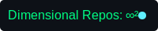

# 『 HIROSHI NOHARA 』

<h1 style="color: #00ff87;">TRANSCENDING THE BOUNDARIES OF REALITY</h1>

## About
Welcome to my GitHub profile, where I warp reality with code! Explore quantum-inspired visualizations that pulse with life, all rendered directly on this page.

## Quantum Visualizations

*Quantum Particles: Simulating superposition and entanglement.*

*Neural Network: Visualizing AI’s synaptic connections.*

*Matrix Rain: A cascade of quantum symbols.*

*Consciousness Stream: Mapping the flow of thought.*

*Quantum Entanglement: Linked particles defying space.*

*Hyperspace Consciousness: Exploring higher dimensions.*

*Reality Fabric: Weaving the threads of existence.*

*Quantum State Generator: Crafting infinite possibilities.*

## 💻 Tech Stack

  
  
  
  
  

## 📊 Quantum Stats

  
  
  

## 🚀 Featured Projects

**Quantum Compiler**  
Compiling reality itself  
*∞ stars | ∞² forks*

**Neural Network Orchestrator**  
Orchestrating the symphony of AI  
*∞ stars | ∞² forks*

**Dimensional Data Visualizer**  
Visualizing the fabric of reality  
*∞ stars | ∞² forks*

## 📈 Contributions

  

## 👁️‍🗨️ Profile Views

  

