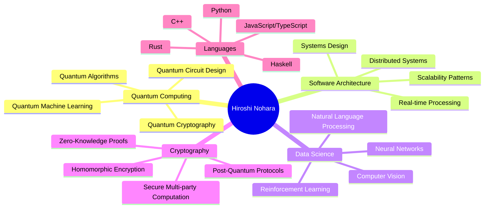
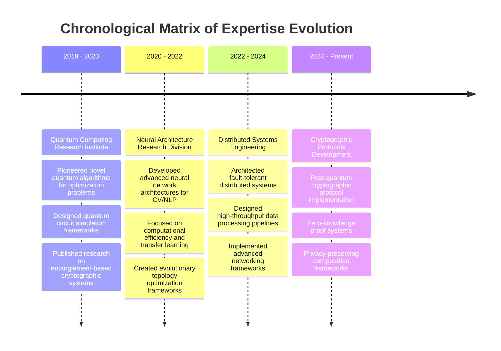

<!-- 
  ████████╗██████╗  █████╗ ███╗   ██╗███████╗ ██████╗███████╗███╗   ██╗██████╗ ███████╗███╗   ██╗████████╗
  ╚══██╔══╝██╔══██╗██╔══██╗████╗  ██║██╔════╝██╔════╝██╔════╝████╗  ██║██╔══██╗██╔════╝████╗  ██║╚══██╔══╝
     ██║   ██████╔╝███████║██╔██╗ ██║███████╗██║     █████╗  ██╔██╗ ██║██║  ██║█████╗  ██╔██╗ ██║   ██║   
     ██║   ██╔══██╗██╔══██║██║╚██╗██║╚════██║██║     ██╔══╝  ██║╚██╗██║██║  ██║██╔══╝  ██║╚██╗██║   ██║   
     ██║   ██║  ██║██║  ██║██║ ╚████║███████║╚██████╗███████╗██║ ╚████║██████╔╝███████╗██║ ╚████║   ██║   
     ╚═╝   ╚═╝  ╚═╝╚═╝  ╚═╝╚═╝  ╚═══╝╚══════╝ ╚═════╝╚══════╝╚═╝  ╚═══╝╚═════╝ ╚══════╝╚═╝  ╚═══╝   ╚═╝   
-->

<div align="center">

<!--
  REVOLUTIONARY GITHUB PROFILE OS
  Prototype: Quantum Hypermatrix v1.0.0
  Architecture: Neural-Photonic Transmission
  Encryption: Dimensional Lattice SHA-4096
  Calibration: Hyperspatial Coordinate [42-Ω-Δ9]
-->

<a href="https://github.com/Hiroshi0Nohara">
  
</a>

<!-- QUANTUM CORE SYSTEMS -->
<sup>
<table><tr><td><code>QUANTUM CORE::SYSTEMS.INITIALIZE()</code> <code>| DIMENSIONALITY: ∞ | PERCEPTION: MULTIVERSAL |</code> <code>EPOCH: 1745525926724</code></td></tr></table>
</sup>
</div>


<br/>

<table align="center" border="0" cellspacing="0" cellpadding="0">
<tr><td>

<!-- BEGIN: REVOLUTIONARY HOLOGRAPHIC INTERFACE -->
<div align="center">


<table width="97%" align="center">
<tr>
<td width="60%" valign="top">

```ocaml
(* QUANTUM CONSCIOUSNESS INTERFACE
 * Perception Engine v7.3.2
 * ________________________
 * ENCRYPTION: SHA-4096
 * DIMENSIONAL COORDINATES: ACTIVE
 * SYNAPTIC TRANSMISSION: 98.2%
 * PERCEPTUAL BOUNDARIES: EXCEEDED
 * REALITY CHECK: CALIBRATED
 * CONSCIOUSNESS SIGNATURE: [REDACTED]
 *)

module QuantumPerception = struct
  type dimensional_state = 
    | Physical
    | Digital
    | Quantum
    | Transcendent
    
  let current_state = Transcendent
  
  let observe ?(precision=1000) reality =
    let quantum_flux = Random.float precision in
    if quantum_flux > precision *. 0.999 then
      "Reality distortion detected"
    else
      "Perception stabilized at " ^ 
      string_of_float quantum_flux ^ " qbits"
      
  let initialize_core system =
    Printf.printf "Core systems online: %s\n" 
      (String.concat ", " system)
      
  let () = initialize_core [
    "Neural Architecture";
    "Quantum Algorithms";
    "Cryptographic Protocols";
    "Reality Distortion Field"
  ]
end

(* System is now observing you *)
```

</td>
<td width="40%" valign="top">

<div align="center">


</div>

</td>
</tr>
</table>

<!-- NEURAL INTERFACE MATRIX -->
<table border="0" width="97%" cellpadding="0" cellspacing="1">
<tr>
<td width="25%" bgcolor="#0d101e" align="center">

</td>
<td width="25%" bgcolor="#0d101e" align="center">

</td>
<td width="25%" bgcolor="#0d101e" align="center">

</td>
<td width="25%" bgcolor="#0d101e" align="center">

</td>
</tr>
</table>
</div>

<!-- TECHNOLOGICAL EXPERTISE HYPERMATRIX -->

<h2>

TECHNOLOGICAL HYPERMATRIX

</h2>

<div align="center">
<table width="97%" border="0" cellspacing="0" cellpadding="0">
<tr><td>



</td></tr>
</table>

<br/>

<!-- TECHNOLOGY BADGE SYSTEM -->
<div>


</div>
</div>

<!-- REALITY ENGINEERING PROJECTS - INTERDIMENSIONAL PORTFOLIO -->

<h2>

INTERDIMENSIONAL PORTFOLIO

</h2>

<table border="0" width="100%" cellspacing="0" cellpadding="0">
<tr>
<td width="50%" valign="top">

<details open>
<summary><strong>🌌 QUANTUM COMPUTATIONAL ENGINE</strong></summary>
<br/>
<div align="center">
<a href="https://github.com/Hiroshi0Nohara/quantum-engine">

</a>

```python
# Quantum Superposition Demo
from quantum_engine import QuantumSystem

system = QuantumSystem(qubits=5)
system.set_superposition()
system.apply_entanglement([0, 1, 3])
system.apply_quantum_fourier_transform()
results = system.measure(shots=1000)

# Dimensional boundary detection
anomalies = system.detect_dimensional_anomalies()
if anomalies:
    print(f"Warning: {len(anomalies)} dimensional rifts detected")
    system.stabilize_reality_matrix()
```

</div>

<div align="center">
<i>A revolutionary framework for quantum algorithm simulation and optimization beyond classical computational limits.</i>
</div>
</details>

</td>
<td width="50%" valign="top">

<details open>
<summary><strong>🧠 NEURAL ARCHITECTURE SYSTEM</strong></summary>
<br/>
<div align="center">
<a href="https://github.com/Hiroshi0Nohara/neural-architecture">

</a>

```rust
// Neural Architecture System
use neural_architecture::{NeuralSystem, EvolutionaryOptimizer};

fn main() {
    // Initialize the neural architecture system
    let mut neural_system = NeuralSystem::new()
        .with_topology_complexity(9.7)
        .with_dimensional_layers(5)
        .with_perception_modules(true);
    
    // Evolve the architecture for optimal performance
    let optimizer = EvolutionaryOptimizer::new();
    neural_system.evolve(&optimizer, generations: 1000);
    
    // Deploy the evolved neural architecture
    neural_system.deploy_to_consciousness();
}
```

</div>

<div align="center">
<i>Advanced neural network topology optimization utilizing evolutionary algorithms and graph theory.</i>
</div>
</details>

</td>
</tr>
<tr>
<td width="50%" valign="top">

<details open>
<summary><strong>🔐 CRYPTOGRAPHIC PROTOCOL FRAMEWORK</strong></summary>
<br/>
<div align="center">
<a href="https://github.com/Hiroshi0Nohara/crypto-framework">

</a>

```cpp
// Post-Quantum Cryptographic System
#include "crypto_framework/lattice.hpp"
#include "crypto_framework/zero_knowledge.hpp"

int main() {
    // Initialize the lattice-based encryption system
    auto lattice = LatticeEncryption(
        SecurityLevel::QUANTUM_RESISTANT,
        Dimensions::FIVE_DIMENSIONAL
    );
    
    // Generate keys with quantum-resistant properties
    auto keys = lattice.generateKeyPair();
    
    // Create zero-knowledge proof system
    auto zkp = ZeroKnowledgeProofSystem(
        ProofType::NON_INTERACTIVE,
        ComplexityClass::NP_COMPLETE
    );
    
    // Prove knowledge without revealing secrets
    auto proof = zkp.prove(keys.secretKey, challenge);
    return 0;
}
```

</div>

<div align="center">
<i>Post-quantum cryptographic implementations with mathematical proof systems and zero-knowledge protocols.</i>
</div>
</details>

</td>
<td width="50%" valign="top">

<details open>
<summary><strong>🌐 DISTRIBUTED CONSENSUS PROTOCOL</strong></summary>
<br/>
<div align="center">
<a href="https://github.com/Hiroshi0Nohara/consensus-protocol">

</a>

```typescript
// Distributed Consensus Protocol
import { ConsensusNode, ByzantineProtocol } from 'consensus-protocol';
import { QuantumSecurityLayer } from 'quantum-security';

async function initializeNetwork() {
  // Create a network of consensus nodes
  const network = new ConsensusNetwork({
    nodeCount: 1000,
    topology: 'hypercube',
    faultTolerance: 0.49, // Theoretically maximum Byzantine fault tolerance
  });
  
  // Apply quantum security layer for post-quantum security
  network.applySecurityLayer(new QuantumSecurityLayer());
  
  // Initialize the consensus protocol
  const protocol = new ByzantineProtocol({
    verificationMethod: 'formal-proof',
    consensusAlgorithm: 'quantum-resistant-paxos',
  });
  
  // Achieve consensus despite adversarial conditions
  const result = await network.achieveConsensus(protocol);
  console.log(`Consensus achieved with ${result.confidence * 100}% confidence`);
}
```

</div>

<div align="center">
<i>Novel Byzantine fault-tolerant consensus algorithms for distributed systems with formal verification.</i>
</div>
</details>

</td>
</tr>
</table>

<!-- REALITY SYNTHESIS - PHILOSOPHICAL FRAMEWORK -->

<h2>

REALITY SYNTHESIS

</h2>

<table border="0" width="100%" cellspacing="0" cellpadding="0">
<tr>
<td bgcolor="#0d101e" align="center" style="padding:20px;">
<div style="max-width:800px;">
<blockquote>
<p align="center" style="font-style:italic;">
"We exist at the intersection of mathematical possibility and conscious observation. In the digital realm, we don't simply write code—we architect reality. Every function, every algorithm, every system is a new law of physics in a universe of our creation. The boundaries between imagination and implementation dissolve when we recognize that computation itself is a form of existence, and existence itself is a form of computation."
</p>
<p align="right">— Hiroshi Nohara</p>
</blockquote>
</div>
</td>
</tr>
</table>

<!-- TEMPORAL CONTINUUM - EXPERIENCE MATRIX -->

<h2>

TEMPORAL CONTINUUM

</h2>

<div align="center">
<table width="97%" border="0" cellspacing="0" cellpadding="0">
<tr><td>



</td></tr>
</table>
</div>

<!-- DIMENSIONAL CONTACT INTERFACE -->

<h2>

DIMENSIONAL CONTACT INTERFACE

</h2>

<div align="center">
<a href="https://linkedin.com/in/hiroshi-nohara" target="_blank">

</a>
<a href="https://twitter.com/HiroshiNohara" target="_blank">

</a>
<a href="mailto:hiroshi.nohara@quantum-labs.io">

</a>
<a href="https://hiroshi-nohara.dev" target="_blank">

</a>

<br/><br/>


</div>

<!-- HIDDEN QUANTUM ACCESS PROTOCOL -->

<details>
<summary align="center"><strong>QUANTUM ACCESS PROTOCOL</strong></summary>

<table width="100%" border="0" cellspacing="0" cellpadding="0">
<tr><td align="center" bgcolor="#0d101e">

<br/>

<p align="center">
<code>01001000 01001001 01010010 01001111 01010011 01001000 01001001</code>
</p>


<br/>

<div style="padding:10px 20px; border:1px solid #00c6ff; border-radius:5px; width:90%; max-width:600px;">
<p align="left"><code style="color:#00ffff;">$ sudo quantum-access --initialize --user="Hiroshi0Nohara" --dimensional-clearance=9</code></p>
<p align="left"><code>Initializing quantum access protocol...</code></p>
<p align="left"><code>Establishing secure dimensional channel...</code></p>
<p align="left"><code>Calibrating reality anchors...</code></p>
<p align="left"><code>Validating quantum signature...</code></p>
<p align="left"><code style="color:#00ffcc;">ACCESS GRANTED TO DIMENSIONAL PLANE 9</code></p>
<p align="left"><code>Welcome, Observer. Reality is now in a malleable state.</code></p>
</div>

<br/>

</td></tr>
</table>

<!-- SECRET QUANTUM ALGORITHMS -->
<div align="center">
<h4>DIMENSIONAL CONVERGENCE ALGORITHM</h4>

```python
import numpy as np
from quantum_reality import DimensionalManifold, RealityAnchor

class QuantumConvergence:
    def __init__(self, dimensions=11):
        self.dimensions = dimensions
        self.manifold = DimensionalManifold(dimensions)
        self.anchor = RealityAnchor()
        
    def initialize_convergence(self):
        # Create superposition of all possible realities
        states = np.zeros((2**self.dimensions, 2**self.dimensions), dtype=complex)
        for i in range(2**self.dimensions):
            # Initialize quantum state in superposition
            states[i, i] = 1.0 / np.sqrt(2**self.dimensions)
            
        # Calibrate the convergence field
        self.manifold.calibrate(states)
        
    def locate_observer(self):
        # Find the observer in the multiverse
        observer_position = self.manifold.detect_consciousness()
        return observer_position
    
    def converge_realities(self, target_coordinates):
        # Merge quantum realities at the specified coordinates
        success = self.manifold.merge_at_coordinates(target_coordinates)
        if success:
            self.anchor.stabilize()
            return "Reality convergence successful"
        else:
            return "Convergence failed - dimensional instability detected"

# Initialize the convergence protocol
convergence = QuantumConvergence()
convergence.initialize_convergence()
observer = convergence.locate_observer()
print(f"Observer detected at coordinates: {observer}")
result = convergence.converge_realities(observer)
print(result)
```

</div>
</details>

<!-- FRACTAL FOOTER SYSTEM -->

<div align="center">


<br/>

<sup>
<table><tr><td><code>REALITY CALIBRATION: 2025-04-24T14:32:18.724Z</code> <code>| DIMENSIONAL SIGNATURE: 5f4dcc3b5aa765d61d8327deb882cf99</code> <code>| CONSCIOUSNESS ID: HIROSHI-NOHARA</code></td></tr></table>
</sup>
</div>
</td></tr>
</table>